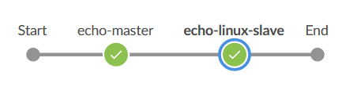
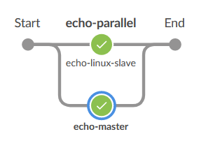

# parallel syntax について

並列でパイプライン処理が出来る場合、全体的なジョブの実行時間が短縮できる可能性が高いです。  
ジョブの内容によりますが、並列数が多いほどマシンスペックが必要です。  
　  

ex.   
* 複数の Git リポジトリを同時にクローンする。  
* 複数の環境で同じテストを実行する。  
* 同じ成果物を複数のサイトに配布する。  

## サンプル

次の 2 つのパイプラインはビルドしている内容は同じですが、parallel 有り無しで実行タイミングが異なります。  

### parallel 無し

[master-linux-node-hello-world-stage.Jenkinsfile](../../../templates/multi-node/master-linux-node-hello-world-stage.Jenkinsfile):  

```groovy
node('master') {
  stage('echo-master') {
    sh label: '', script: 'echo "Hello, World! from master."'
  }
}
node('linux-slave') {
  stage('echo-linux-slave') {
    sh label: '', script: 'echo "Hello, World! from linux-slave."'
  }
}
```

  

parallel 無しなので直列に ``echo-master`` → ``echo-linux-slave`` の順に実行されていることが分かります。  


### parallel 有り


[master-linux-node-stage-parallel.Jenkinsfile.Jenkinsfile](../../../templates/multi-node/master-linux-node-stage-parallel.Jenkinsfile):  

```groovy
stage('echo-parallel') {
  parallel(
    "echo-master": {
      node('master') {
        sh label: '', script: 'echo "Hello, World! from master."'
      }
    }
    ,"echo-linux-slave": {
      node('linux-slave') {
        sh label: '', script: 'echo "Hello, World! from linux-slave."'
      }
    }
  )
}
```

  

parallel 有りは ``echo-master`` ``echo-linux-slave`` が並列（同じ列）で実行されていることが分かります。  
どちらが先に開始、終了するか分かりませんので、前後関係がある物は並列で実行するとエラーになります。  


　  
　  
　  
　  
　  
　  
　  
　  

* * *

###### :copyright: 商標について

<sup>当ドキュメントに記載されている会社名、システム名、製品名は一般に各社の登録商標または商標です。</sup>  
<sup>なお、本文および図表中では、「™」、「®」は明記しておりません。</sup>  

###### 免責事項  
<sup>当ドキュメント上の掲載内容については細心の注意を払っていますが、その情報に関する信頼性、正確性、完全性について保証するものではありません。</sup>  
<sup>掲載された内容の誤り、および掲載された情報に基づいて行われたことによって生じた直接的、また間接的トラブル、損失、損害については、筆者は一切の責任を負いません。</sup>  
<sup>また当ドキュメント、およびドキュメントに含まれる情報、コンテンツは、通知なしに随時変更されます。</sup>  


