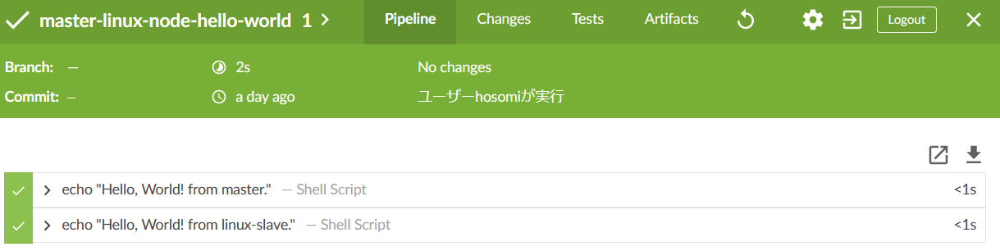
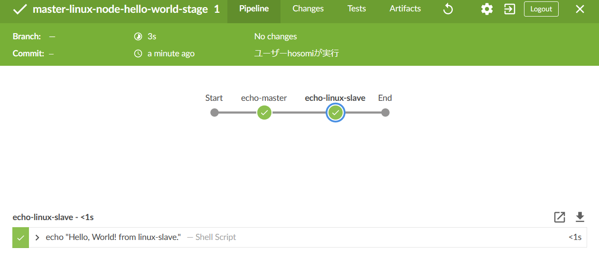

# stage block について

簡単なパイプラインについては定義してなくても特に影響ありませんが、  
複雑なパイプラインで結果を確認する時は見たい箇所にすばやくどのブロックかを特定するのに役立ちます。  

## サンプル

次の 2 つのパイプラインはビルドしている内容は同じですが、Blue Ocean で結果を表示した場合、見た目が変わります。  

[master-linux-node-hello-world.Jenkinsfile](../../templates/multi-node/master-linux-node-hello-world.Jenkinsfile):  

```groovy
node('master') {
  sh label: '', script: 'echo "Hello, World! from master."'
}
node('linux-slave') {
  sh label: '', script: 'echo "Hello, World! from linux-slave."'
}
```

Blue Ocean で結果表示：  

  

---

[master-linux-node-hello-world-stage.Jenkinsfile](../../templates/multi-node/master-linux-node-hello-world-stage.Jenkinsfile):  

```groovy
node('master') {
  stage('echo-master') {
    sh label: '', script: 'echo "Hello, World! from master."'
  }
}
node('linux-slave') {
  stage('echo-linux-slave') {
    sh label: '', script: 'echo "Hello, World! from linux-slave."'
  }
}
```

Blue Ocean で結果表示：  

  

　  
　  
　  


複雑なジョブを作成するときは ``stage`` 単位で纏めて定義していくのが、パイプラインジョブの作成、結果の確認で役に立つと思います。  
``stage`` block を積極的に使っていきましょう。  


　  
　  
　  
　  
　  
　  
　  
　  

* * *

###### :copyright: 商標について

<sup>当ドキュメントに記載されている会社名、システム名、製品名は一般に各社の登録商標または商標です。</sup>  
<sup>なお、本文および図表中では、「™」、「®」は明記しておりません。</sup>  

###### 免責事項  
<sup>当ドキュメント上の掲載内容については細心の注意を払っていますが、その情報に関する信頼性、正確性、完全性について保証するものではありません。</sup>  
<sup>掲載された内容の誤り、および掲載された情報に基づいて行われたことによって生じた直接的、また間接的トラブル、損失、損害については、筆者は一切の責任を負いません。</sup>  
<sup>また当ドキュメント、およびドキュメントに含まれる情報、コンテンツは、通知なしに随時変更されます。</sup>  


