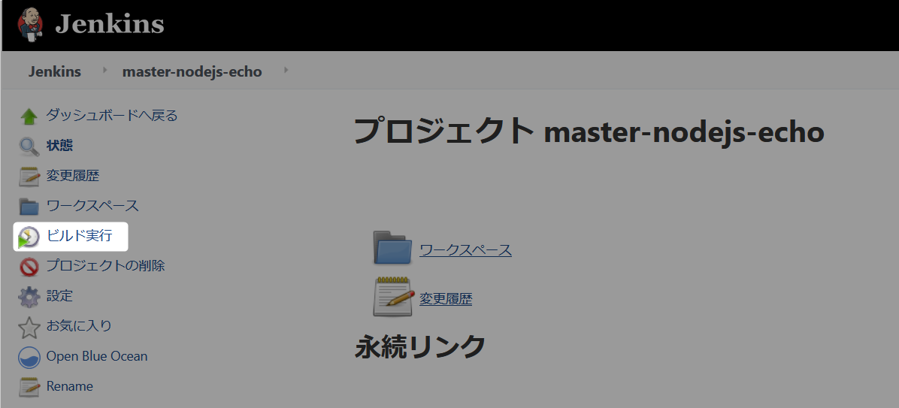
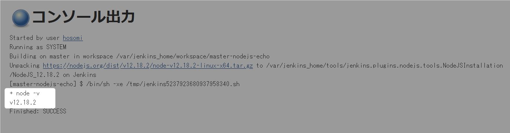

# NodeJS

各種バージョンの NodeJS が Jenkins から利用できるようになります。  
ランタイムのインストールも自動で行ってくるので便利です。

## 1. NodeJS plugin 導入

ブラウザから ``http://localhost:8080`` にアクセスしてください。  

### 1.1 メニューから Jenkinsの管理をクリック

  

### 1.2 Jenkinsの管理からプラグインの管理をクリック

  

### 1.3 プラグインマネージャーからプラグインを追加

1. ``利用可能タブ`` を選択。
2. 検索ボックスに ``NodeJS`` と入力。
3. 検索された NodeJS にチェックする。
4. ダウンロードして再起動後にインストールをクリックする。

  

### 1.4 Jenkins 再起動

プラグインのインストール/アップグレード画面で  
``インストール完了後、ジョブがなければJenkinsを再起動する``  
にチェックをいれてください。  

  

ブラウザから ``http://localhost:8080`` にアクセスしてください。  
再起動している旨の画面が表示されます、しばらくするとログイン画面に移動します。  

　  

## 2. NodeJS plugin 設定

どのバージョンを利用するのか予め設定が必要です。  

### 2.1 メニューから Jenkinsの管理をクリック

  

### 2.2 Jenkinsの管理から Global Tool Configuration をクリック

  

### 2.3 NodeJs に追加

下にスクロールしたら、NodeJS の項目が表示されます。  

  

バージョンを一つ追加するのは ``NodeJS追加`` ボタンを押してください。  

#### 2.3.1 NodeJS LTS を追加

現在（コミット日時参照）は LTS（長期サーポートの安定版）は 12.18.2 ですので、そのバージョンを指定して導入します。  

次のように設定しましょう。  

| 設定項目 | 設定内容 
| ----- | ---- 
| 名前 | NodeJS 12.18.2  ``（何でも良いですが、利用者が分かりやすい名前が望ましいです。）``  
| バージョン | NodeJS 12.18.2 ``（一覧から選択してください。）`` 

（変更項目のみ）

  

設定できたら ``Save`` ボタンをクリックしてください。

## 3. NodeJS plugin の利用

NodeJs のバージョンを echo する簡単なフリースタイルジョブを作成して実行します。  

### 3.1 メニューから新規ジョブ作成をクリック

  

### 3.2 作成するジョブ名とタイプを選択

1. ジョブ名に ``master-nodejs-echo`` を入力。
2. 作成するジョブタイプから ``フリースタイル・プロジェクトのビルド`` を選択。
3. ``OK`` ボタンをクリック。

  

### 3.3 ジョブ定義

| タブ項目 | 設定項目 | 設定内容 
| ----- | ----- | ----- 
| General | 実行するノードを制限 | チェックする。  
| " | 実行するノードを制限 » ラベル式 | mater  
| ビルド環境 | Provide Node & npm bin/ folder to PATH |  チェックする。  
| " | Provide Node & npm bin/ folder to PATH » NodeJS Installation | NodeJS 12.18.2 ``一つしかない場合は選択済み、その他は初期値のまま`` 
| ビルド | ビルド手順の追加 | ``シェルの実行`` を選択。
| " | シェルの実行 » シェルスクリプト | ``node -v``

``保存`` ボタンで定義を保存してください。  

設定項目のスクリーンショット：  

* General » 実行するノードを制限 » ラベル式 
  

* ビルド環境 » Provide Node & npm bin/ folder to PATH

  

* ビルド  » ビルド手順の追加  

  

* ビルド  » シェルの実行  

  

### 3.4 ビルド実行

早速実行してみましょう。

  

### 3.4 実行結果の確認

ビルド履歴から ``#1`` をクリックしてください。

  

次に ``コンソール出力`` をクリックしてください。

  
　  
↓
　  

  

設定した NodeJS と同じバージョンが出力されているでしょうか。  
違うバージョンも設定してバージョンを変えて出力してみましょう。  
パイプラインジョブでの利用方法は別途解説します。  

---

### 4. NodeJS のグローバルインストールを使いたい場合

``npm i -g [パッケージ名]`` のように指定のパッケージをグローバルインストールしてビルド時に利用したい場合は次のように設定します。

　  

[2.3.1 NodeJS LTS を追加](#2.3.1 NodeJS LTS を追加) の手順で ``Global npm packages to install`` の項目にグローバルインストールしたいパッケージ名を入力します。  

    

(``@angular/cli`` は Angular CLI の最新バージョンが実行時にグローバルインストールされます。)  

    

　  
　  
　  
　  
　  
　  
　  
　  

* * *

###### :copyright: 商標について

当ドキュメントに記載されている会社名、システム名、製品名は一般に各社の登録商標または商標です。  
なお、本文および図表中では、「™」、「®」は明記しておりません。  

###### 免責事項  
当ドキュメント上の掲載内容については細心の注意を払っていますが、その情報に関する信頼性、正確性、完全性について保証するものではありません。  
掲載された内容の誤り、および掲載された情報に基づいて行われたことによって生じた直接的、また間接的トラブル、損失、損害については、筆者は一切の責任を負いません。  
また当ドキュメント、およびドキュメントに含まれる情報、コンテンツは、通知なしに随時変更されます。  

