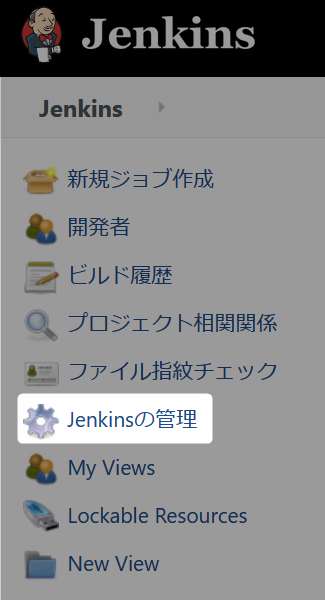
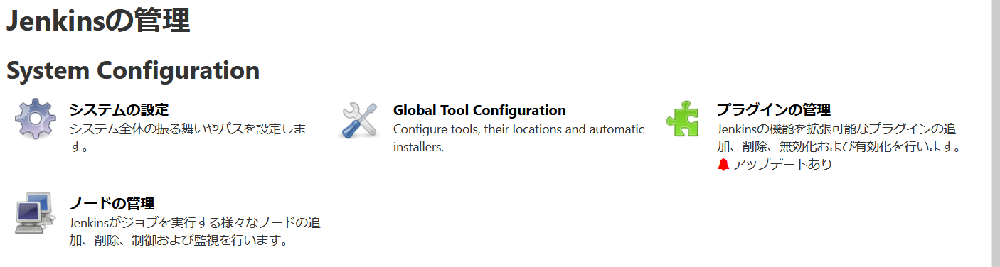
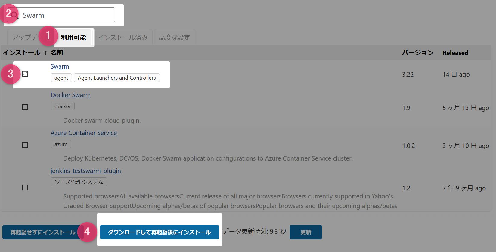
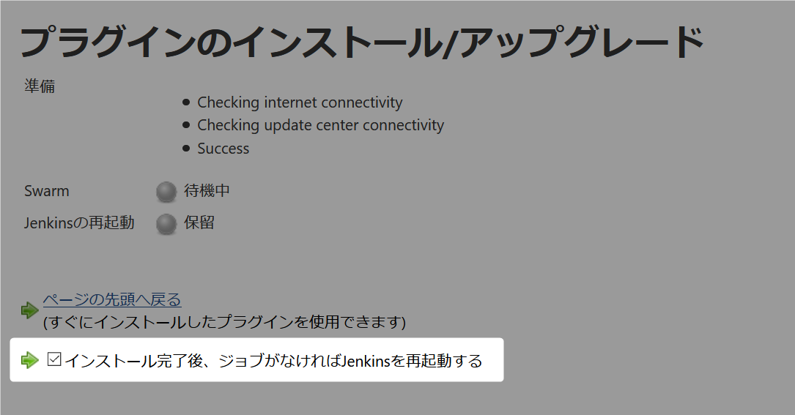

# Swarm Plugin を追加

Jenkins slave の追加をやりやすくするために、プラグインを追加します。  
ブラウザから ``http://localhost:8080`` にアクセスしてください。  

## 1. メニューから Jenkinsの管理をクリック

  

## 2. Jenkinsの管理からプラグインの管理をクリック

  

## 3. プラグインマネージャーからプラグインを追加

1. ``利用可能タブ`` を選択。
2. 検索ボックスに ``Swarm`` と入力。
3. 検索された Swarm にチェックする。
4. ダウンロードして再起動後にインストールをクリックする。

  

## 4. Jenkins 再起動

プラグインのインストール/アップグレード画面で  
``インストール完了後、ジョブがなければJenkinsを再起動する``  
にチェックをいれてください。  

  

ブラウザから ``http://localhost:8080`` にアクセスしてください。  
再起動している旨の画面が表示されます、しばらくするとログイン画面に移動します。  

　  
　  
　  

この手順は他のプラグインを追加する場合も同様の操作で追加できます。　  
　  

　  
　  
　  
　  
　  

* * *

###### :copyright: 商標について

当ドキュメントに記載されている会社名、システム名、製品名は一般に各社の登録商標または商標です。  
なお、本文および図表中では、「™」、「®」は明記しておりません。  

###### 免責事項  
当ドキュメント上の掲載内容については細心の注意を払っていますが、その情報に関する信頼性、正確性、完全性について保証するものではありません。  
掲載された内容の誤り、および掲載された情報に基づいて行われたことによって生じた直接的、また間接的トラブル、損失、損害については、筆者は一切の責任を負いません。  
また当ドキュメント、およびドキュメントに含まれる情報、コンテンツは、通知なしに随時変更されます。  

