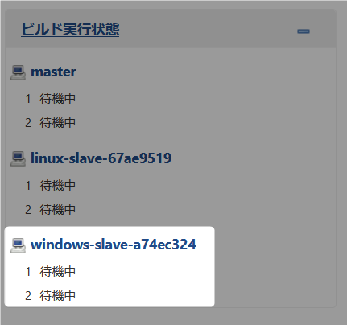

# Jenkins Slave Windows

ホストマシン上に Windows Slave を構築します。  
:exclamation: ``ローカルマシンの環境を汚すのでその旨を理解して作業を行ってください。``  


## 1. Chocolatey のインストール

パッケージ管理ソフトウェアに ``Chocolatey`` を利用します。  
``Chocolatey がインストール済みの方は事項に進んでください。``  
次のリンクを参照してインストールしてください。  

:link: [Chocolatey Software - Installing Chocolatey](https://chocolatey.org/install#installing-chocolatey)  

## 2. JDK 8 インストール

Chocolatey から JDK 8 をインストールします。

:link: [Chocolatey Software - Java SE 8.0.211](https://chocolatey.org/packages/jdk8)

``PowerShell のターミナルを管理者権限で実行してください。``  

``choco install jdk8 -y -params 'installdir=c:\\java8'`` :   
(jdk8 の最新を確認プロントを常に Y で c:\java8 にインストールします。)  

```PowerShell
choco install jdk8 -y -params 'installdir=c:\\java8'
```

## 3. Git クライアントインストール（オプション）

Chocolatey から Git をインストールします。  
こちらはオプションです必要であればインストールしてください。  

:link: [Chocolatey Software - Git 2.28.0](https://chocolatey.org/packages/git)  

``choco install git -y`` : 

```PowerShell
choco install git -y
```
## 4. swarm launcher をダウンロードして初期設定

### 4.1 ダウンロード

展開先は任意です。  

* Git クライアントがある方はクローンしてください。  

``git clone https://github.com/hosomi/swarm-launcher.git`` : 

* Git クライアントが無い方は Zip をダウンロードして展開してください。

https://github.com/hosomi/swarm-launcher/archive/master.zip

### 5.2 swarm launcher の設定

swarm-launcher 直下の ``build.gradle`` ファイルをテキストエディタで開きます。  

args 部分のみ変更します。  
* ``-master`` : Jenkins master のアドレスに変更します、``http://localhost:8080`` に設定してください。 
* ``-name`` : Slave の名前です、特に拘りが無ければ ``windows-slave`` に。 
* ``-username`` : Jenkins master にログインする ユーザ名です。  
* ``-password`` : -username のパスワードです。    
* ``-fsroot`` : Slave のワークスペースルートです（例では事前に c:\jenkins フォルダを作成しました）。  
* ``-labels`` : Slave を識別する別の名前（ラベル式）です。 

```java
task start(type: JavaExec) {
    classpath = configurations.tool
    main = "hudson.plugins.swarm.Client"
    args([
        "-master", "http://localhost:8080",
        "-name", "windows-slave",
        "-username", "hosomi",
        "-password", "**************",
        "-fsroot", "c:\\jenkins",
        "-executors", "2",
        "-deleteExistingClients",
        "-labels", ["windows-slave"].join(" "),
        "-mode", "exclusive",
    ])
}
```

変更後ファイルを保存してください。

### 5.3 swarm launcher の起動

PowerShell ターミナルで swarm-laucher 直下のフォルダまで移動してください。  

環境変数の ``JAVA_HOME`` を一時的に ``c:\java8`` に変更します（ターミナル終了後に破棄されます）。  

``$env:JAVA_HOME = "C:\\java8"`` :   

```powershell
PS \swarm-launcher> $env:JAVA_HOME = "C:\\java8"
```

次に起動します。  

``.\gradlew.bat`` :   

```powershell
PS \swarm-launcher> .\gradlew.bat
Starting a Gradle Daemon (subsequent builds will be faster)
> Task :start
情報: Connected
<-------------> 0% EXECUTING [20s]
> :start
```

``http://localhost:8080`` にログインして追加されているか確認してください。  
追加されていない、エラーが発生している場合は設定ファイルを見直してください。  


  

Slave の終了は ``CTRL + C`` で終了させてください。  


　  
　  
　  
　  
　  
　  
　  
　  

* * *

###### :copyright: 商標について

<sup>当ドキュメントに記載されている会社名、システム名、製品名は一般に各社の登録商標または商標です。</sup>  
<sup>なお、本文および図表中では、「™」、「®」は明記しておりません。</sup>  

###### 免責事項  
<sup>当ドキュメント上の掲載内容については細心の注意を払っていますが、その情報に関する信頼性、正確性、完全性について保証するものではありません。</sup>  
<sup>掲載された内容の誤り、および掲載された情報に基づいて行われたことによって生じた直接的、また間接的トラブル、損失、損害については、筆者は一切の責任を負いません。</sup>  
<sup>また当ドキュメント、およびドキュメントに含まれる情報、コンテンツは、通知なしに随時変更されます。</sup>  


