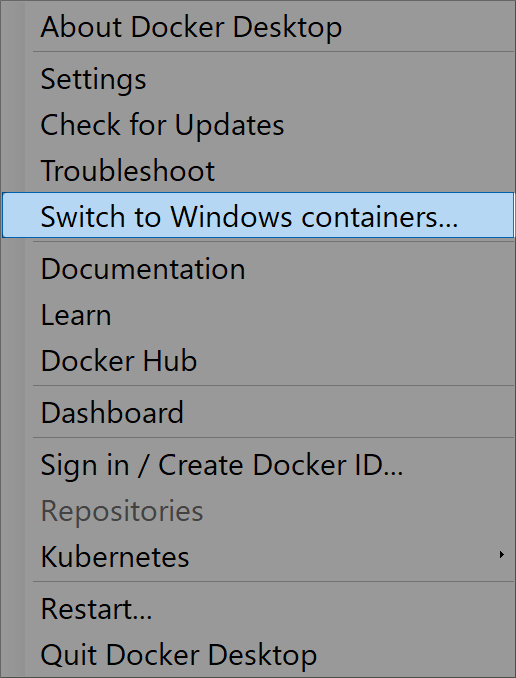
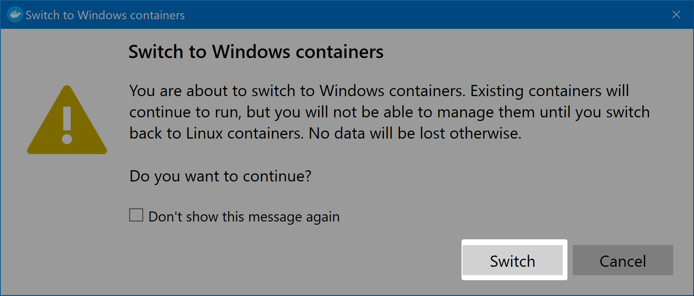

# Jenkins slave windows

:warning: ``ご注意：Windows ホスト限定です。``  
:warning: ``イメージのサイズが巨大(5GB ぐらい)なので注意してください。``   

## 1. Windows コンテナのセットアップ

### 1.1 Microsoft Docs を参照

:link: [Windows コンテナーの基本イメージ | Microsoft Docs](https://docs.microsoft.com/ja-jp/virtualization/windowscontainers/manage-containers/container-base-images)  
| 今回は Windows サーバーコアを使います。  
→ [Windows Server Core - Docker Hub](https://hub.docker.com/_/microsoft-windows-servercore)


### 1.2 イメージをダウンロード

``docker pull mcr.microsoft.com/windows/servercore:ltsc2019``: 


正常の場合：  

```cmd
> docker pull mcr.microsoft.com/windows/servercore:ltsc2019
ltsc2019: Pulling from windows/servercore
4612f6d0b889: Pull complete
fc1b9e59edad: Pull complete
Digest: sha256:921bed01c2a023310bdbaa288edebd82c4910e536ff206b87e9cbe703ca27505
Status: Downloaded newer image for mcr.microsoft.com/windows/servercore:ltsc2019
mcr.microsoft.com/windows/servercore:ltsc2019
```


:triangular_flag_on_post: 次のようなエラーになる場合：  

```cmd
> docker pull mcr.microsoft.com/windows/servercore:ltsc2019
ltsc2019: Pulling from windows/servercore
no matching manifest for linux/amd64 in the manifest list entries
```

次の手順でホスト側のコンテナを Windows に切り替えてください。

1. タスクバーの Docker のアイコンで右クリック。

  

2. 表示されたメニューから ``Switch to Windows containers...`` を選択。

  

3. 確認ダイアログで Switch ボタンをクリック。

  


4. もう一度、``docker pull mcr.microsoft.com/windows/servercore:ltsc2019`` 実行する。


``linux container に戻すには同じ操作(1. 2. 3.)を行ってください。``  

### 1.3 ダウンロードされたイメージを確認


``docker images``:

```cmd
> docker images
REPOSITORY                             TAG                 IMAGE ID            CREATED             SIZE
mcr.microsoft.com/windows/servercore   ltsc2019            987b1d5e0abf        2 weeks ago         4.99GB
```

REPOSITORY と TAG が同じか確認してください。


### 1.4 起動

PowerShell の対話型で起動します。 
``初回のみ``  

``docker run -i -t mcr.microsoft.com/windows/servercore:ltsc2019 powershell``: 

```cmd
> docker run -i -t mcr.microsoft.com/windows/servercore:ltsc2019 powershell
Windows PowerShell
Copyright (C) Microsoft Corporation. All rights reserved.

PS C:\>
```

PowerSehll のプロンプトが表示されたら起動済みです。  


#### 1.4.1 システム情報の確認

``systeminfo``:

```cmd
PS C:\> systeminfo

Host Name:                 FF46F53B536F
OS Name:                   Microsoft
OS Version:                10.0.17763 N/A Build 17763
OS Manufacturer:           Microsoft Corporation
OS Configuration:          Standalone Server
OS Build Type:             Multiprocessor Free

・・省略
```


#### 1.4.2 プロンプトの終了

プロンプトを終了したい場合は ``exit`` で終了しますが、コンテナも停止します。  
コンテナを起動したままにする場合は ``Ctrl+p`` の後に ``Ctrl+q`` で終了してください。  

``exit`` で終了した場合：

```cmd
> docker ps -a
CONTAINER ID        IMAGE                                           COMMAND             CREATED             STATUS                     PORTS               NAMES
ff46f53b536f        mcr.microsoft.com/windows/servercore:ltsc2019   "powershell"        8 minutes ago       Exited (0) 8 seconds ago                       sleepy_kowalevski
```

STATUS が Exited でコンテナは停止しています。  


``Ctrl+p`` の後に ``Ctrl+q``  で終了した場合：  

```cmd
PS C:\> read escape sequence
> docker ps -a
CONTAINER ID        IMAGE                                           COMMAND             CREATED             STATUS              PORTS               NAMES
ff46f53b536f        mcr.microsoft.com/windows/servercore:ltsc2019   "powershell"        10 minutes ago      Up 40 seconds                           sleepy_kowalevski
```

STATUS が Up でコンテナは起動中です。  


#### 1.4.3 再度対話型でプロンプトに入りたい場合

``docker attach [CONTAINER ID]`` コマンドでプロンプトに入ります。  

先に ``docker ps -a`` で CONTAINER ID を調べます。

```cmd
> docker ps -a
CONTAINER ID        IMAGE                                           COMMAND             CREATED             STATUS              PORTS               NAMES
ff46f53b536f        mcr.microsoft.com/windows/servercore:ltsc2019   "powershell"        14 minutes ago      Up 4 minutes                            sleepy_kowalevski
```

この例の場合、CONTAINER ID は ff46f53b536f です。  

``docker attach [CONTAINER ID]``:  

```cmd
> docker attach ff46f53b536f
PS C:\>
```

プロンプトが再度表示されればコンテナ側に入った状態です。  


２回目以降は

1. ``docker ps -a`` 対象の CONTAINER ID を調べる。
2. ``docker start [CONTAINER ID]`` コンテナを起動。
3. ``docker attach [CONTAINER ID]`` プロンプトに入る。

プロンプトに入る必要が無ければ、1. 2. のみです。


　  
　  

* * *

###### :copyright: 商標について

<sup>当ドキュメントに記載されている会社名、システム名、製品名は一般に各社の登録商標または商標です。</sup>  
<sup>なお、本文および図表中では、「™」、「®」は明記しておりません。</sup>  

###### 免責事項  
<sup>当ドキュメント上の掲載内容については細心の注意を払っていますが、その情報に関する信頼性、正確性、完全性について保証するものではありません。</sup>  
<sup>掲載された内容の誤り、および掲載された情報に基づいて行われたことによって生じた直接的、また間接的トラブル、損失、損害については、筆者は一切の責任を負いません。</sup>  
<sup>また当ドキュメント、およびドキュメントに含まれる情報、コンテンツは、通知なしに随時変更されます。</sup>  


