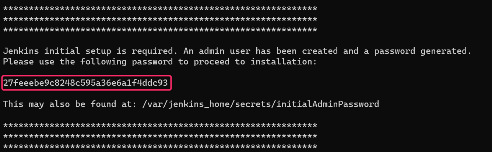
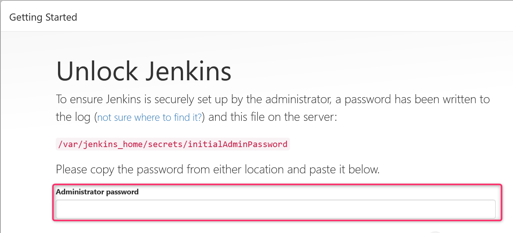
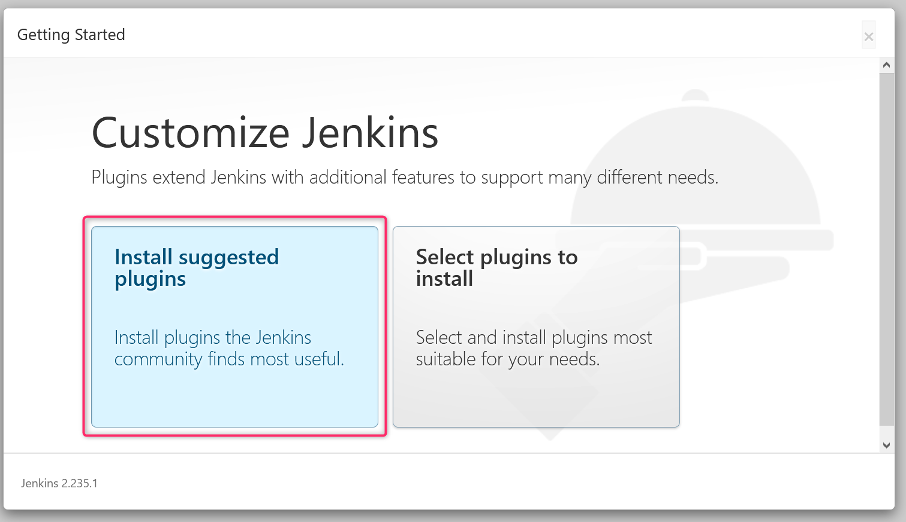
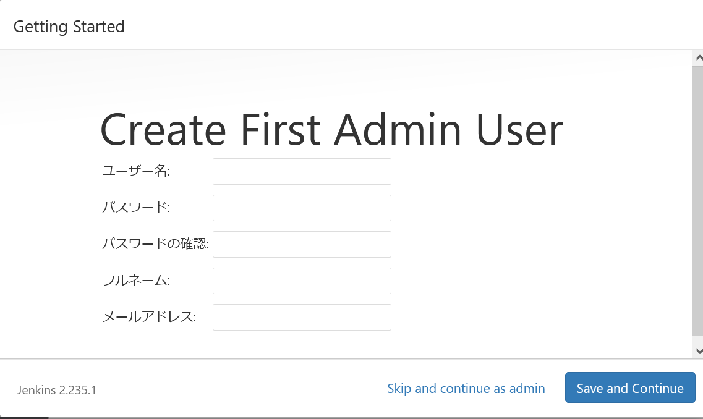
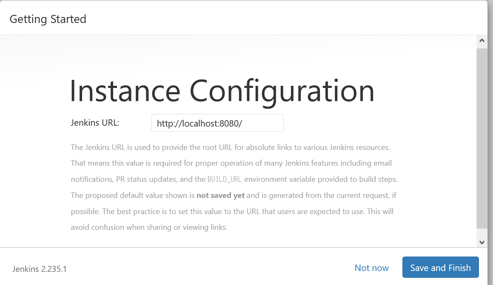
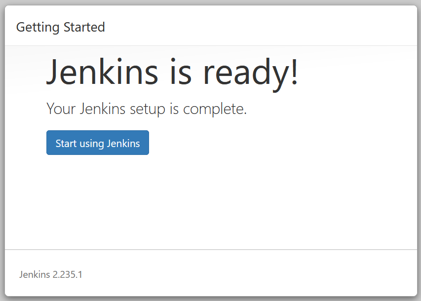

# Jenkins and Docker

[Docker](https://www.docker.com/) で Jenkins master を構築します。  

:link: [Jenkins and Docker](https://www.jenkins.io/solutions/docker/)  

## 1. Docker

### 1.1 Docker Deskop install

``*環境がある方はこの作業は不要です。``

[Docker Desktop for Mac and Windows | Docker](https://www.docker.com/products/docker-desktop) に移動して対象の環境を選択してください。  
Windows の場合、Download for Windows(stable)を選択。  
ダウンロード後、ダンロードしたファイルを実行してください、インストール後再起動が必要です。

### 1.2 Docker image download

Docker のイメージとして Official Jenkins master image for Docker を利用します。  

参考情報：  
:link: [jenkins/jenkins - Docker Hub](https://hub.docker.com/r/jenkins/jenkins)

コマンドプロンプト、ターミナルで次を実行。  
（プロンプトは全て `` > `` で表示されます。）

``docker pull jenkins/jenkins:lts``（LTS 版を指定します。） :  

```
> docker pull jenkins/jenkins:lts
lts: Pulling from jenkins/jenkins
3192219afd04: Pull complete
17c160265e75: Pull complete
cc4fe40d0e61: Pull complete
9d647f502a07: Pull complete
d108b8c498aa: Pull complete
1bfe918b8aa5: Pull complete
dafa1a7c0751: Pull complete
778e8430be10: Pull complete
f691085434e7: Pull complete
c773ad417853: Pull complete
588c47e03ebf: Pull complete
188896fc235c: Pull complete
531c409665fe: Pull complete
7d45f079f587: Pull complete
bf743b158a31: Pull complete
8dcb6fcd107c: Pull complete
485a955ebd4a: Pull complete
822b6d40c0ee: Pull complete
36b4ce80355f: Pull complete
Digest: sha256:0e8912b04f962b258ff9f51fb85fd1a9c5458e9d6e2f84aee747d765de0b7b70
Status: Downloaded newer image for jenkins/jenkins:lts
docker.io/jenkins/jenkins:lts
```

### 1.3 Docker image 確認

``docker images`` :

```
> docker images
REPOSITORY          TAG                 IMAGE ID            CREATED             SIZE
jenkins/jenkins     lts                 60f81923d099        9 days ago          658MB
```


## 1.4 Jenkins image 起動

``docker run -p 8080:8080 -p 50000:50000 jenkins/jenkins:lts`` :

```
> docker run -p 8080:8080 -p 50000:50000 jenkins/jenkins:lts
Running from: /usr/share/jenkins/jenkins.war
webroot: EnvVars.masterEnvVars.get("JENKINS_HOME")
2020-06-27 10:37:51.316+0000 [id=1]     INFO    org.eclipse.jetty.util.log.Log#initialized: Logging initialized @519ms to org.eclipse.jetty.util.log.JavaUtilLog
2020-06-27 10:37:51.456+0000 [id=1]     INFO    winstone.Logger#logInternal: Beginning extraction from war file
2020-06-27 10:37:52.492+0000 [id=1]     WARNING o.e.j.s.handler.ContextHandler#setContextPath: Empty contextPath
2020-06-27 10:37:52.542+0000 [id=1]     INFO    org.eclipse.jetty.server.Server#doStart: jetty-9.4.27.v20200227; built: 2020-02-27T18:37:21.340Z; git: a304fd9f351f337e7c0e2a7c28878dd536149c6c; jvm 1.8.0_242-b08
2020-06-27 10:37:52.811+0000 [id=1]     INFO    o.e.j.w.StandardDescriptorProcessor#visitServlet: NO JSP Support for /, did not find org.eclipse.jetty.jsp.JettyJspServlet
2020-06-27 10:37:52.873+0000 [id=1]     INFO    o.e.j.s.s.DefaultSessionIdManager#doStart: DefaultSessionIdManager workerName=node0
2020-06-27 10:37:52.873+0000 [id=1]     INFO    o.e.j.s.s.DefaultSessionIdManager#doStart: No SessionScavenger set, using defaults
2020-06-27 10:37:52.879+0000 [id=1]     INFO    o.e.j.server.session.HouseKeeper#startScavenging: node0 Scavenging every 660000ms
2020-06-27 10:37:53.212+0000 [id=1]     INFO    hudson.WebAppMain#contextInitialized: Jenkins home directory: /var/jenkins_home found at: EnvVars.masterEnvVars.get("JENKINS_HOME")
2020-06-27 10:37:53.342+0000 [id=1]     INFO    o.e.j.s.handler.ContextHandler#doStart: Started w.@9573b3b{Jenkins v2.235.1,/,file:///var/jenkins_home/war/,AVAILABLE}{/var/jenkins_home/war}
2020-06-27 10:37:53.391+0000 [id=1]     INFO    o.e.j.server.AbstractConnector#doStart: Started ServerConnector@69c81773{HTTP/1.1, (http/1.1)}{0.0.0.0:8080}
2020-06-27 10:37:53.392+0000 [id=1]     INFO    org.eclipse.jetty.server.Server#doStart: Started @2595ms
2020-06-27 10:37:53.395+0000 [id=20]    INFO    winstone.Logger#logInternal: Winstone Servlet Engine running: controlPort=disabled
2020-06-27 10:37:54.525+0000 [id=27]    INFO    jenkins.InitReactorRunner$1#onAttained: Started initialization
2020-06-27 10:37:54.546+0000 [id=27]    INFO    jenkins.InitReactorRunner$1#onAttained: Listed all plugins
2020-06-27 10:37:55.573+0000 [id=27]    INFO    jenkins.InitReactorRunner$1#onAttained: Prepared all plugins
2020-06-27 10:37:55.579+0000 [id=28]    INFO    jenkins.InitReactorRunner$1#onAttained: Started all plugins
2020-06-27 10:37:55.593+0000 [id=26]    INFO    jenkins.InitReactorRunner$1#onAttained: Augmented all extensions
2020-06-27 10:37:56.041+0000 [id=28]    INFO    jenkins.InitReactorRunner$1#onAttained: System config loaded
2020-06-27 10:37:56.042+0000 [id=27]    INFO    jenkins.InitReactorRunner$1#onAttained: System config adapted
2020-06-27 10:37:56.044+0000 [id=27]    INFO    jenkins.InitReactorRunner$1#onAttained: Loaded all jobs
2020-06-27 10:37:56.044+0000 [id=25]    INFO    jenkins.InitReactorRunner$1#onAttained: Configuration for all jobs updated
2020-06-27 10:37:56.078+0000 [id=41]    INFO    hudson.model.AsyncPeriodicWork#lambda$doRun$0: Started Download metadata
2020-06-27 10:37:56.106+0000 [id=41]    INFO    hudson.util.Retrier#start: Attempt #1 to do the action check updates server
2020-06-27 10:37:57.242+0000 [id=26]    INFO    o.s.c.s.AbstractApplicationContext#prepareRefresh: Refreshing org.springframework.web.context.support.StaticWebApplicationContext@19ac6b51: display name [Root WebApplicationContext]; startup date [Sat Jun 27 10:37:57 UTC 2020]; root of context hierarchy
2020-06-27 10:37:57.242+0000 [id=26]    INFO    o.s.c.s.AbstractApplicationContext#obtainFreshBeanFactory: Bean factory for application context [org.springframework.web.context.support.StaticWebApplicationContext@19ac6b51]: org.springframework.beans.factory.support.DefaultListableBeanFactory@582ab955
2020-06-27 10:37:57.256+0000 [id=26]    INFO    o.s.b.f.s.DefaultListableBeanFactory#preInstantiateSingletons: Pre-instantiating singletons in org.springframework.beans.factory.support.DefaultListableBeanFactory@582ab955: defining beans [authenticationManager]; root of factory hierarchy
2020-06-27 10:37:57.532+0000 [id=26]    INFO    o.s.c.s.AbstractApplicationContext#prepareRefresh: Refreshing org.springframework.web.context.support.StaticWebApplicationContext@18ba1779: display name [Root WebApplicationContext]; startup date [Sat Jun 27 10:37:57 UTC 2020]; root of context hierarchy
2020-06-27 10:37:57.532+0000 [id=26]    INFO    o.s.c.s.AbstractApplicationContext#obtainFreshBeanFactory: Bean factory for application context [org.springframework.web.context.support.StaticWebApplicationContext@18ba1779]: org.springframework.beans.factory.support.DefaultListableBeanFactory@f2523c9
2020-06-27 10:37:57.533+0000 [id=26]    INFO    o.s.b.f.s.DefaultListableBeanFactory#preInstantiateSingletons: Pre-instantiating singletons in org.springframework.beans.factory.support.DefaultListableBeanFactory@f2523c9: defining beans [filter,legacy]; root of factory hierarchy
2020-06-27 10:37:57.848+0000 [id=26]    INFO    jenkins.install.SetupWizard#init:

*************************************************************
*************************************************************
*************************************************************

Jenkins initial setup is required. An admin user has been created and a password generated.
Please use the following password to proceed to installation:

27feeebe9c8248c595a36e6a1f4ddc93

This may also be found at: /var/jenkins_home/secrets/initialAdminPassword

*************************************************************
*************************************************************
*************************************************************

2020-06-27 10:38:04.119+0000 [id=41]    INFO    h.m.DownloadService$Downloadable#load: Obtained the updated data file for hudson.tasks.Maven.MavenInstaller
2020-06-27 10:38:04.120+0000 [id=41]    INFO    hudson.util.Retrier#start: Performed the action check updates server successfully at the attempt #1
2020-06-27 10:38:04.122+0000 [id=41]    INFO    hudson.model.AsyncPeriodicWork#lambda$doRun$0: Finished Download metadata. 8,039 ms
2020-06-27 10:38:05.344+0000 [id=25]    INFO    jenkins.InitReactorRunner$1#onAttained: Completed initialization
2020-06-27 10:38:05.363+0000 [id=19]    INFO    hudson.WebAppMain$3#run: Jenkins is fully up and running
```

Please use the following password to proceed to installation:  
の次の行の出力内容をメモしておく、今回の場合は
27feeebe9c8248c595a36e6a1f4ddc93  
　  
補足：  
  


## 2 Jenkins Getting Started

ブラウザから ``http://localhost:8080`` にアクセス。  

### 2.1 Unlock Jenkins
 
Unlock Jenkins が表示されますので、前項の出力内容を Administrator password に入力して右下の Continue ボタンをクリック。

補足：  
  
　  
### 2.2 Customize Jenkins

インストールするプラグインを提案と自分で選択する 2 択で聞いてきますが、
左の Install suggested plugins を選択してください。  
``*後でも追加、削除が可能です。``

補足：  
  


しばらく時間がかかります。


### 2.3 Create First Admin User

管理者ユーザの登録を行います。  
全て必須入力です。  
入力が終わったら、右下の Save and Continue をクリックしてください。  

補足：  
  


### 2.4 Instance Configuration

Jenkins の URL を設定します、この URL はビルド通知、パスワードを忘れた場合の通知等で利用されます。  
``*後でも変更可能です。 ``  
Save and Finish をクリックしてください。  

  


### 2.5 Jenkins is ready!

以上で終了です。  

  


## 3. docker image (Jenkins) 停止方法

### 3.1 停止対象を調べる

``docker ps -a`` :   

```
> docker ps -a
CONTAINER ID        IMAGE                 COMMAND                  CREATED             STATUS              PORTS
       NAMES
13920882163e        jenkins/jenkins:lts   "/sbin/tini -- /usr/…"   49 minutes ago      Up 49 minutes       0.0.0.0:8080->8080/tcp, 0.0.0.0:50000->50000/tcp   magical_albattani
```

出力されている CONTAINER ID をメモします。  
この例ですと CONTAINER ID は 13920882163e です。  

### 3.2 停止する


``docker stop [CONTAINER ID]`` :  

```
> docker stop 13920882163e
13920882163e
```

### 3.3 停止しているか確認

``docker ps -a`` :   

```
> docker ps -a
CONTAINER ID        IMAGE                 COMMAND                  CREATED             STATUS                            PORTS               NAMES
13920882163e        jenkins/jenkins:lts   "/sbin/tini -- /usr/…"   54 minutes ago      Exited (143) About a minute ago                       magical_albattani
```

STATUS が Exited と表示されていれば停止している状態です。

　  
　  
　  
　  
　  
　  
　  
　  

* * *

###### :copyright: 商標について

<sup>当ドキュメントに記載されている会社名、システム名、製品名は一般に各社の登録商標または商標です。</sup>  
<sup>なお、本文および図表中では、「™」、「®」は明記しておりません。</sup>  

###### 免責事項  
<sup>当ドキュメント上の掲載内容については細心の注意を払っていますが、その情報に関する信頼性、正確性、完全性について保証するものではありません。</sup>  
<sup>掲載された内容の誤り、および掲載された情報に基づいて行われたことによって生じた直接的、また間接的トラブル、損失、損害については、筆者は一切の責任を負いません。</sup>  
<sup>また当ドキュメント、およびドキュメントに含まれる情報、コンテンツは、通知なしに随時変更されます。</sup>  


