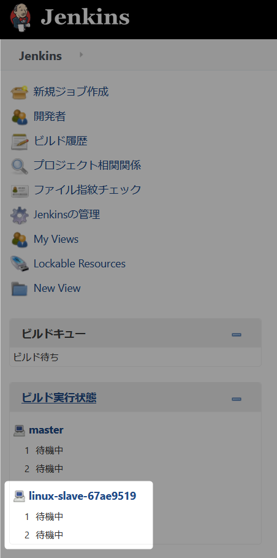

# Jenkins Slave Linux

Jenkin Slave として CentOS7.x 系で構築します。    
master と同様に Docker image を利用します。  

:link: [centos - Docker Hub](https://hub.docker.com/_/centos)    

## 1 CentOS image download

``docker pull centos:centos7``（CentOS7 最新） :  

```
> docker pull centos:centos7
centos7: Pulling from library/centos
524b0c1e57f8: Pull complete
Digest: sha256:e9ce0b76f29f942502facd849f3e468232492b259b9d9f076f71b392293f1582
Status: Downloaded newer image for centos:centos7
docker.io/library/centos:centos7
```


## 2 Docker image を確認する

``docker images`` :

```
> docker images
REPOSITORY          TAG                 IMAGE ID            CREATED             SIZE
jenkins/jenkins     lts                 60f81923d099        2 weeks ago         658MB
centos              centos7             b5b4d78bc90c        8 weeks ago         203MB
```

この時点では jenkins master イメージと今回ダウンロードした centos の 2 つあります。

## 3 Jenkins master の ip address を確認

slave から master に接続するので master の ip address の情報が必要になります。  
事前に確認してメモしておきます。  


### 3.1 Jenkins master の CONTAINER ID を調べる


``docker ps -a``:

```
> docker ps -a
CONTAINER ID        IMAGE                 COMMAND                  CREATED             STATUS              PORTS                                              NAMES
13920882163e        jenkins/jenkins:lts   "/sbin/tini -- /usr/…"   6 days ago          Up 7 minutes        0.0.0.0:8080->8080/tcp, 0.0.0.0:50000->50000/tcp   magical_albattani
```

CONTAINER ID をメモしておく。


### 3.2 Jenkins master のコンテナを調べる

先程メモした CONTAINER ID から調べる。

``docker inspect [CONTAINER ID]``:

```
> docker inspect 13920882163e
[
    {
        "Id": "13920882163e7cade54622f29b2be93e23e770f2de1a051afab59eefd0ba1c61",
        "Created": "2020-06-27T10:37:50.477212166Z",

省略

            "Networks": {
                "bridge": {
                    "IPAMConfig": null,
                    "Links": null,
                    "Aliases": null,
                    "NetworkID": "5175fdac81213d6804fa4d091e65b071ae9766d3e58c4f410dad389ea69b50d4",
                    "EndpointID": "4eecbb1b53dc194c82b42b840e33150473ab730247acd5bdaeb2e4b8cc252030",
                    "Gateway": "172.17.0.1",
                    "IPAddress": "172.17.0.2",
                    "IPPrefixLen": 16,
                    "IPv6Gateway": "",
                    "GlobalIPv6Address": "",
                    "GlobalIPv6PrefixLen": 0,
                    "MacAddress": "02:42:ac:11:00:02",
                    "DriverOpts": null
                }
            }
        }
    }
]
```

IPAddress の項目が Jenkins master の ip address です。  
この例の場合、172.17.0.2 となります。


## 4 CentOS7 のコンテナを起動

``docker run -itd --privileged -p 2222:22 --name centos7 centos:centos7 /sbin/init``:  

```
> docker run -itd --privileged -p 2222:22 --name centos7 centos:centos7 /sbin/init
534e21afeda8b07399c625a28e05a107580035f808faab0951207c1e7f4a3b03
```

| オプション | 内容
| ----- | ----- 
| -itd  | コンテナのプロセスに tty を割り当ててバックグランドでコンテナを起動。
| -p | ポート指定(ssh のみ 2222(ホスト) -> 22(コンテナ))。
| --privileged | systemctl を使えるようにする。  
| –-name | コンテナの名前を指定。  

## 4.1 コンテナが起動しているか確認する

``docker ps -a`` :

```
> docker ps -a
CONTAINER ID        IMAGE                 COMMAND                  CREATED             STATUS              PORTS                                              NAMES
534e21afeda8        centos:centos7        "/sbin/init"             26 seconds ago      Up 26 seconds       0.0.0.0:2222->22/tcp                               centos7
13920882163e        jenkins/jenkins:lts   "/sbin/tini -- /usr/…"   6 days ago          Up 7 minutes        0.0.0.0:8080->8080/tcp, 0.0.0.0:50000->50000/tcp   magical_albattani
```

jenkins master と今回起動した centos7 の 2 つあります。  
STATUS の項目で Up が起動済みです、Exited は停止状態です。  

## 5 CentOS7 のコンテナに SSH ログイン(tty)

コンテナの CentOS7 にパッケージの追加と設定を行う為、SSH ログイン(tty) します。

``docker exec -it centos7 /bin/bash``:  

```
> docker exec -it centos7 /bin/bash
[root@534e21afeda8 /]#
```

CentOS7 の Bash がコマンドを待ち受ける状態になります。  


### 5.1 CentOS7 のコンテナに必要なパッケージをインストール

JDK8 と Git Client を yum でインストールします。

``yum install -y java-1.8.0-openjdk.x86_64 git``: 


```bash
[root@534e21afeda8 /]# yum install -y java-1.8.0-openjdk.x86_64 git
Loaded plugins: fastestmirror, ovl
Loading mirror speeds from cached hostfile
 * base: ftp-srv2.kddilabs.jp
 * extras: ftp-srv2.kddilabs.jp
 * updates: ftp-srv2.kddilabs.jp
Resolving Dependencies

省略

Complete!
```

### 5.2 JAVA_HOME を設定

salve を起動するアプリケーションは Java のランタイムだけではなく JAVA_HOME の設定が必要です。  

#### 5.2.1 /etc/profile に JAVA_HOME を設定 

``vi /etc/profile``:  

```bash
[root@534e21afeda8 jre]# vi /etc/profile
```

vi のキーボード操作 

``shift + g``: 最終行に移動。  
``o``: 一行追加して編集モード。  
``export JAVA_HOME=/usr/lib/jvm/java-1.8.0-openjdk-1.8.0.252.b09-2.el7_8.x86_64/jre``: 入力または貼り付けてください。  
``esc``: コマンドモードに移行。  
``wq ``: 保存して終了（wq 次に enter）。  


#### 5.2.2 /etc/profile を読み込む

``source /etc/profile``:  

```bash
[root@534e21afeda8 jre]# source /etc/profile
```


### 5.3 Jenkins slave を起動する

#### 5.3.1 Slave を起動するアプリケーションを git clone して取得


``git clone https://github.com/hosomi/swarm-launcher.git``:

```bash
[root@534e21afeda8 /]# git clone https://github.com/hosomi/swarm-launcher.git
Cloning into 'swarm-launcher'...
remote: Enumerating objects: 6, done.
remote: Counting objects: 100% (6/6), done.
remote: Compressing objects: 100% (6/6), done.
remote: Total 18 (delta 1), reused 2 (delta 0), pack-reused 12
Unpacking objects: 100% (18/18), done.
```

#### 5.3.2 git clone したアプリケーションの設定ファイルを編集

swarm-launcher の設定ファイルを編集する

```bash
[root@534e21afeda8 /]# cd swarm-launcher/
[root@534e21afeda8 swarm-launcher]# vi build.gradle
```

args の項目を編集します。


| args | 説明 | 設定値
| ----- | ----- | -----
| -master  | Jenkins master の URL | 3.2 でしらべた ip address、今回の例の場合、http://172.17.0.2:8080  
| -name | スレーブの名前のプレフィックス | ``linux-slave``  
| -username | Jenkins にログインするID | Jekins にログインするユーザ ID を設定。  
| -password | Jenkins にログインするID のパスワード | Jekins にログインするユーザ ID のパスワードを設定。  
| -fsroot | スレーブのワークスペースルートパス | ``/root``  
| -labels | スレーブのラベル | ["linux-slave","example1"].join(" ")  

色が変わっている箇所はそのまま入力してください。  
その他の項目は必須ではありません、[こちら](https://github.com/hosomi/swarm-launcher) の説明の内容を確認して必要であれば編集してください。  


#### 5.3.3 実行するファイルを実行権限を付与


``chmod +x gradlew``:

```bash
[root@534e21afeda8 swarm-launcher]# chmod +x gradlew
```


#### 5.3.4 起動

``./gradlew``:  

```bash
[root@534e21afeda8 swarm-launcher]# ./gradlew
Downloading https://services.gradle.org/distributions/gradle-4.6-bin.zip
......................................................................
Unzipping /root/.gradle/wrapper/dists/gradle-4.6-bin/4jp4stjndanmxuerzfseyb6wo/gradle-4.6-bin.zip to /root/.gradle/wrapper/dists/gradle-4.6-bin/4jp4stjndanmxuerzfseyb6wo
Set executable permissions for: /root/.gradle/wrapper/dists/gradle-4.6-bin/4jp4stjndanmxuerzfseyb6wo/gradle-4.6/bin/gradle

省略

<-------------> 0% EXECUTING [1m 30s]
> :start
> IDLE
> IDLE
```

正常に起動できた場合、IDLE 状態で待機状態になります。  
ブラウザから Jenkins ログイン（``http://localhost:8080``）にログインして Slave が追加されている確認。  


    

表示されていたら作業は完了です。  


　  
　  
　  
　  
　  
　  
　  
　  

* * *

###### :copyright: 商標について

<sup>当ドキュメントに記載されている会社名、システム名、製品名は一般に各社の登録商標または商標です。</sup>  
<sup>なお、本文および図表中では、「™」、「®」は明記しておりません。</sup>  

###### 免責事項  
<sup>当ドキュメント上の掲載内容については細心の注意を払っていますが、その情報に関する信頼性、正確性、完全性について保証するものではありません。</sup>  
<sup>掲載された内容の誤り、および掲載された情報に基づいて行われたことによって生じた直接的、また間接的トラブル、損失、損害については、筆者は一切の責任を負いません。</sup>  
<sup>また当ドキュメント、およびドキュメントに含まれる情報、コンテンツは、通知なしに随時変更されます。</sup>  


