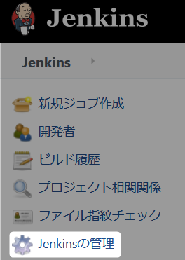
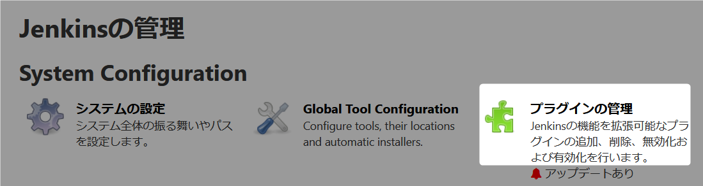
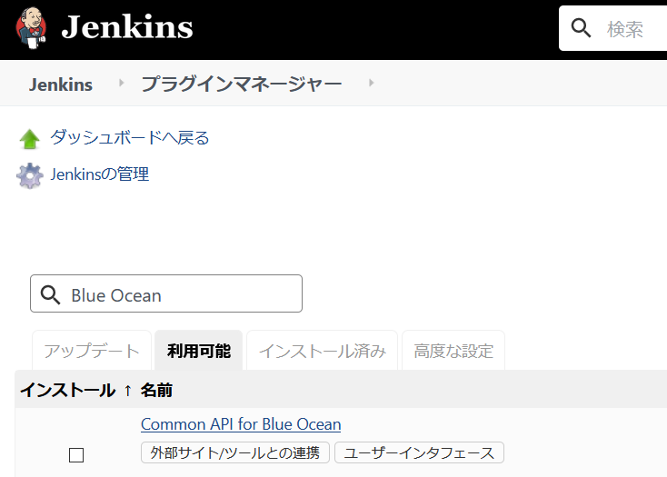
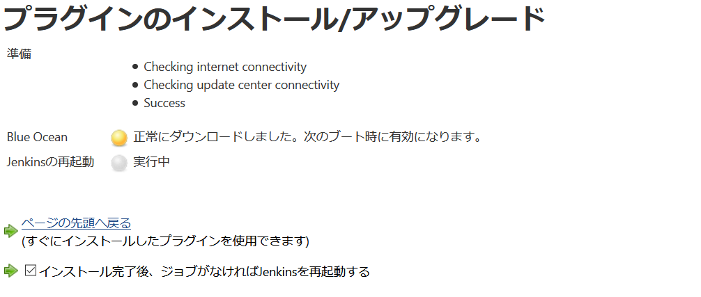
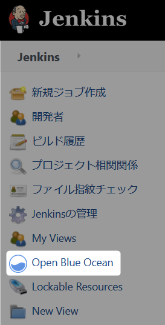
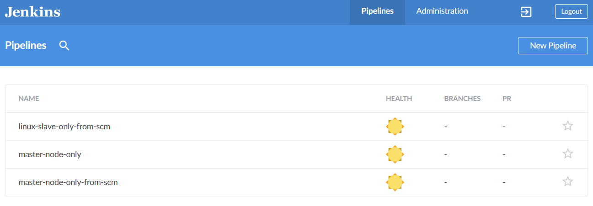
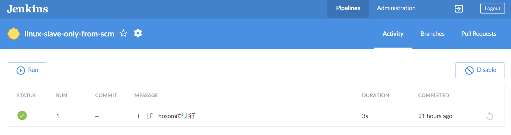
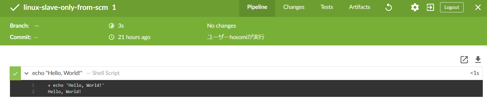

# Blue Ocean 

Jenkins に ``Blue Ocean`` プラグインを追加します。   
パイプラインジョブの作成から結果の視覚化が見やすくなります。  
今回は作成では使いませんが、結果の確認で使います。  

:link: [Blue Ocean](https://www.jenkins.io/projects/blueocean/)  

## 1. Jenkins に ``Blue Ocean`` プラグインを追加

ブラウザから ``http://localhost:8080`` にアクセスしてください。  

## 1.1 メニューから Jenkinsの管理をクリック

  

### 1.2 Jenkinsの管理からプラグインの管理をクリック

  

### 1.3 プラグインマネージャーからプラグインを追加

1. ``利用可能タブ`` を選択。
2. 検索ボックスに ``Blue Ocean`` と入力。
3. 検索された Blue Ocean にチェックする (スクロールして下の方にあります)。
4. ダウンロードして再起動後にインストールをクリックする。

    
　  

↓ にスクロール。  
　  

  
　  

チェックをつけてからダウンロードして再起動後にインストールをクリック。  
  

### 1.4 Jenkins 再起動

プラグインのインストール/アップグレード画面で  
``インストール完了後、ジョブがなければJenkinsを再起動する``  
にチェックをいれてください。  

  

ブラウザから ``http://localhost:8080`` にアクセスしてください。  
再起動している旨の画面が表示されます、しばらくするとログイン画面に移動します。  

---

## 2. Blue Ocean の利用

メニューに ``Open Blue Ocean`` が追加されています。  
クリックしてください。   

  

## 2.1 Blue Ocean 実行結果の確認方法

1. 一覧から１つ目の ``linux-slave-only-from-scm`` を選択してください。

  
　  
　 

2. 実行結果の一覧から１つ目を選択してください。  

  

　  
　 

3. 実行結果の echo "Hello, World!"— Shell Script をクリック

   

ここでは一つしかありませんが、パイプラインのステップの数だけ増えていきます。  

　  
　 

　  
　 

　  
　  
　  

* * *

###### :copyright: 商標について

当ドキュメントに記載されている会社名、システム名、製品名は一般に各社の登録商標または商標です。  
なお、本文および図表中では、「™」、「®」は明記しておりません。  

###### 免責事項  
当ドキュメント上の掲載内容については細心の注意を払っていますが、その情報に関する信頼性、正確性、完全性について保証するものではありません。  
掲載された内容の誤り、および掲載された情報に基づいて行われたことによって生じた直接的、また間接的トラブル、損失、損害については、筆者は一切の責任を負いません。  
また当ドキュメント、およびドキュメントに含まれる情報、コンテンツは、通知なしに随時変更されます。  

