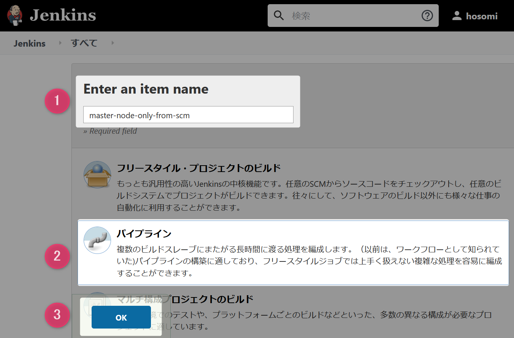
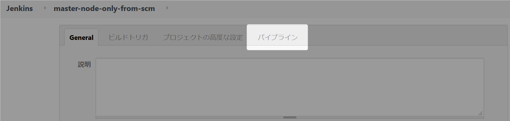
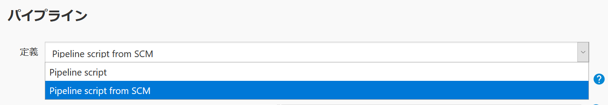
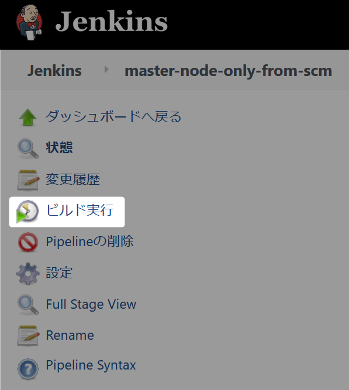
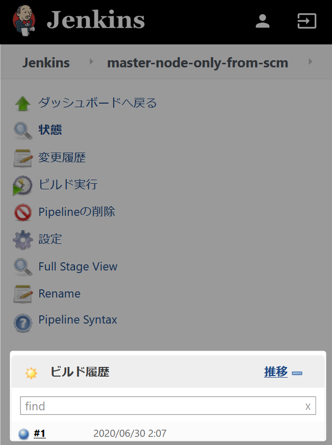
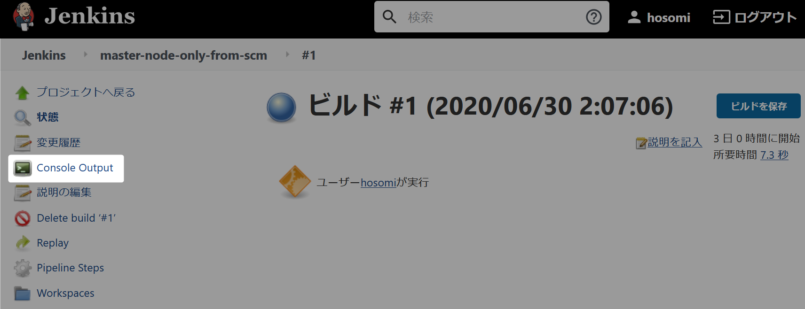
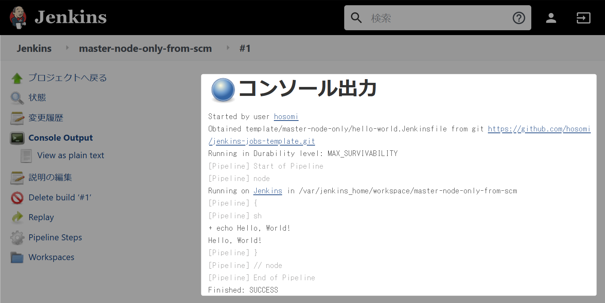

# パイプラインジョブ（Pipeline script from SCM）の作成手順

定義を Pipeline script from SCM を選択して作成する手順です。  
直接 Pipeline script を指定する場合は[こちら](README.md)を参照してください。  

### 1 Jenkins ログイン（``http://localhost:8080``）

### 2 メニューから新規ジョブ作成をクリック

  

### 3 パイプランジョブ作成の基本情報を設定

1. 作成するジョブ名に ``master-node-only-from-scm`` を入力。
1. 作成するジョブの種類から ``パイプライン`` を選択。
1. OK ボタンをクリック。

  

### 4 パイプラインのスクリプトを SCM から指定

#### 4.1 一番下までスクロールするかタブメニューからパイプラインを選択

  

#### 4.2 パイプラインの定義を Pipeline script from SCM を選択

  

#### 4.3 Pipeline script from SCM の基本情報を設定する

| 大項目 | 項目 | 設定する内容
| ----- | ----- | -----
| 定義 | - | Pipeline script from SCM
| リポジトリ | SCM | Git
| ” | リポジトリ URL | https://github.com/hosomi/jenkins-jobs-template.git
| ” | 認証情報 | - なし
| ビルドするブランチ | 	ブランチ指定子 (空欄はすべてを指定)	 | */master
| Script Path | - | template/master-node-only/hello-world.Jenkinsfile

### 4.3 保存ボタンをクリック

### 5 ビルド実行

### 5.1 メニューからビルド実行をクリック

   

### 5.2 ビルド実行結果を確認  
　  
#### 5.2.1 ビルド履歴から ``#1`` をクリック  
　  
 
　  
#### 5.2.2 メニューの Console Output をクリック  
　  
  
　  
#### 5.2.3 コンソール出力内容を確認  
　  
Git（``https://github.com/hosomi/jenkins-jobs-template.git``） 経由になっていることと、  
``Hello, World!`` が出力されていることを確認してください。
　  

  

　  
　  
　  
　  
　  
　  
　  
　  

* * *

###### :copyright: 商標について

当ドキュメントに記載されている会社名、システム名、製品名は一般に各社の登録商標または商標です。  
なお、本文および図表中では、「™」、「®」は明記しておりません。  

###### 免責事項  
当ドキュメント上の掲載内容については細心の注意を払っていますが、その情報に関する信頼性、正確性、完全性について保証するものではありません。  
掲載された内容の誤り、および掲載された情報に基づいて行われたことによって生じた直接的、また間接的トラブル、損失、損害については、筆者は一切の責任を負いません。  
また当ドキュメント、およびドキュメントに含まれる情報、コンテンツは、通知なしに随時変更されます。  

